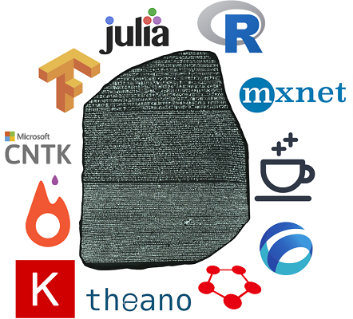

# Deep Learning Framework Examples

<p align="center">

</p>

*Note: We have recently added multi-GPU (single-node) examples on fine-tuning DenseNet-121 on Chest X-rays aka [CheXnet](https://stanfordmlgroup.github.io/projects/chexnet/). This is still work-in-progress and contributions are highly welcome!*

**For more details check out our [blog-post](https://blogs.technet.microsoft.com/machinelearning/2018/03/14/comparing-deep-learning-frameworks-a-rosetta-stone-approach/)**

## Goal

1. Create a Rosetta Stone of deep-learning frameworks to allow data-scientists to easily leverage their expertise from one framework to another
2. Optimised GPU code with using the most up-to-date highest-level APIs.
3. Common setup for comparisons across GPUs (potentially CUDA versions and precision)
4. Common setup for comparisons across languages (Python, Julia, R)
5. Possibility to verify expected performance of own installation
4. Collaboration between different open-source communities

The notebooks are executed on an Azure [Deep Learning Virtual Machine](https://azuremarketplace.microsoft.com/en-us/marketplace/apps/microsoft-ads.dsvm-deep-learning) using both the K80 and the newer P100. 

*Accuracies are reported in notebooks, they should match to ensure we have common mode/code*

## Results

### 1. Training Time(s): CNN (VGG-style, 32bit) on CIFAR-10 - Image Recognition

| DL Library                                            | K80/CUDA 8/CuDNN 6 | P100/CUDA 8/CuDNN 6 |
| ----------------------------------------------------- | :----------------: | :-----------------: |
| [Caffe2](notebooks/Caffe2_CNN.ipynb)                  |        148         |         54          |
| [Chainer](notebooks/Chainer_CNN.ipynb)                |        162         |         69          |
| [CNTK](notebooks/CNTK_CNN.ipynb)                      |        163         |         53          |
| [Gluon](notebooks/Gluon_CNN.ipynb)                    |        152         |         62          |
| [Keras(CNTK)](notebooks/Keras_CNTK_CNN.ipynb)         |        194         |         76          |
| [Keras(TF)](notebooks/Keras_TF_CNN.ipynb)             |        241         |         76          |
| [Keras(Theano)](notebooks/Keras_Theano_CNN.ipynb)     |        269         |         93          |
| [Tensorflow](notebooks/Tensorflow_CNN.ipynb)          |        173         |         57          |
| [Lasagne(Theano)](notebooks/Theano_Lasagne_CNN.ipynb) |        253         |         65          |
| [MXNet](notebooks/MXNet_CNN.ipynb)                    |        145         |         51          |
| [PyTorch](notebooks/PyTorch_CNN.ipynb)                |        169         |         51          |
| [Julia - Knet](notebooks/Knet_CNN.ipynb)              |        159         |         ??          |
| [R - MXNet](notebooks/.ipynb)                         |        ???         |         ??          |
| [R - Keras (TF)](notebooks/KerasR_TF_CNN.ipynb)       |        211         |         ??          |


*Note: It is recommended to use higher level APIs where possible; see these notebooks for examples with [Tensorflow](support/Tensorflow_CNN_highAPI.ipynb), [MXNet](support/MXNet_CNN_highAPI.ipynb) and [CNTK](support/CNTK_CNN_highAPI.ipynb). They are not linked in the table to keep the common-structure-for-all approach*

Input for this model is the standard [CIFAR-10 dataset](http://www.cs.toronto.edu/~kriz/cifar.html) containing 50k training images and 10k test images, uniformly split across 10 classes. Each 32 by 32 image is supplied as a tensor of shape (3, 32, 32) with pixel intensity re-scaled from 0-255 to 0-1. 

### 2. Training Time: DenseNet-121 on ChestXRay - Image Recognition (Multi-GPU)

**This is a work in progress**

**CUDA 9/CuDNN 7.0**

| DL Library                                        | 1xP100                | 2xP100                | 4xP100                | **4xP100 Synthetic Data** | 
| -----------------------------------------------   | :------------------:  | :-------------------: | :------------------:  | :------------------:  | 
| [Pytorch](notebooks/PyTorch_MultiGPU.ipynb)       | 41min46s              | 28min50s              | 23min7s               | 11min48s              |
| [Keras(TF)](notebooks/Keras_TF_MultiGPU.ipynb)    | 51min27s              | 32min1s               | 22min49s              | 18min30s              |
| [Tensorflow](notebooks/Tensorflow_MultiGPU.ipynb) | 62min8s               | 44min13s              | 31min4s               | 17min10s              |
| [Chainer]()                                       | ?                     | ?                     | ?                     | ?                     |
| [MXNet]()                                         | ?                     | ?                     | ?                     | ?                     |


Input for this model is 112,120 PNGs of chest X-rays. **Note for the notebook to automatically download the data you must install [Azcopy](https://docs.microsoft.com/en-us/azure/storage/common/storage-use-azcopy-linux#download-and-install-azcopy) and increase the size of your OS-Disk in Azure Portal so that you have at-least 45GB of free-space (the Chest X-ray data is large!). The notebooks may take more than 10 minutes to first download the data.** These notebooks train DenseNet-121 and use native data-loaders to pre-process the data and perform data-augmentation. 

Comparing synthetic data to actual PNG files we can estimate the IO lag for **PyTorch (~11min), Keras(TF) (~4min), Tensorflow (~13min)!** We need to investigate this to establish the most performant data-loading pipeline and any **help is appreciated**. The current plan is to write functions in OpenCV (or perhaps use ChainerCV) and share between all frameworks.

### 3. Avg Time(s) for 1000 images: ResNet-50 - Feature Extraction

| DL Library                                          | K80/CUDA 8/CuDNN 6 | P100/CUDA 8/CuDNN 6 |
| --------------------------------------------------- | :----------------: | :-----------------: |
| [Caffe2](notebooks/Caffe2_Inference.ipynb)          | 14.1               | 7.9                 |
| [Chainer](notebooks/Chainer_Inference.ipynb)        | 9.3                | 2.7                 |
| [CNTK](notebooks/CNTK_Inference.ipynb)              | 8.5                | 1.6                 |
| [Keras(CNTK)](notebooks/Keras_CNTK_Inference.ipynb) | 21.7               | 5.9                 |
| [Keras(TF)](notebooks/Keras_TF_Inference.ipynb)     | 10.2               | 2.9                 |
| [Tensorflow](notebooks/Tensorflow_Inference.ipynb)  | 6.5                | 1.8                 |
| [MXNet](notebooks/MXNet_Inference.ipynb)            | 7.7                | 2.0                 |
| [PyTorch](notebooks/PyTorch_Inference.ipynb)        | 7.7                | 1.9                 |
| [Julia - Knet](notebooks/Knet_Inference.ipynb)      | 6.3                | ???                 |
| [R - MXNet](notebooks/.ipynb)                       | ???                | ???                 |
| [R - Keras (TF)](notebooks/KerasR_TF_Inference.ipynb)| 16                 | ???                 |


A pre-trained ResNet50 model is loaded and chopped just after the avg_pooling at the end (7, 7), which outputs a 2048D dimensional vector. This can be plugged into a softmax layer or another classifier such as a boosted tree to perform transfer learning. Allowing for a warm start; this forward-only pass to the avg_pool layer is timed. *Note: batch-size remains constant, however filling the RAM on a GPU would produce further performance boosts (greater for GPUs with more RAM).*

### 4. Training Time(s): RNN (GRU) on IMDB - Sentiment Analysis

| DL Library                               | K80/CUDA 8/CuDNN 6 | P100/CUDA 8/CuDNN 6 | Using CuDNN? |
| ---------------------------------------- | :----------------: | :----------------:  | :----------: |
| [CNTK](notebooks/CNTK_RNN.ipynb)                   | 32                 | 15                  | Yes          |
| [Keras(CNTK)](notebooks/Keras_CNTK_RNN.ipynb)      | 86                 | 53                  | No           |
| [Keras(TF)](notebooks/Keras_TF_RNN.ipynb)          | 35                 | 26                  | Yes          |
| [MXNet](notebooks/MXNet_RNN.ipynb)                 | 29                 | 24                  | Yes          |
| [Pytorch](notebooks/PyTorch_RNN.ipynb)             | 31                 | 16                  | Yes          |
| [Tensorflow](notebooks/Tensorflow_RNN.ipynb)       | 30                 | 22                  | Yes          |
| [Julia - Knet](notebooks/Knet_RNN.ipynb)           | 29                 | ??                  | Yes          |
| [R - MXNet](notebooks/.ipynb)                      | ??                 | ??                  | ???          |
| [R - Keras (TF)](notebooks/KerasR_TF_RNN.ipynb)    | 238                | ??                  | No           |


Input for this model is the standard [IMDB movie review dataset](http://ai.stanford.edu/~amaas/data/sentiment/) containing 25k training reviews and 25k test reviews, uniformly split across 2 classes (positive/negative). Processing follows [Keras](https://github.com/fchollet/keras/blob/master/keras/datasets/imdb.py) approach where start-character is set as 1, out-of-vocab (vocab size of 30k is used) represented as 2 and thus word-index starts from 3. Zero-padded / truncated to fixed axis of 150 words per review.

Where possible I try to use the cudnn-optimised RNN (noted by the CUDNN=True switch), since we have a vanilla RNN that can be easily reduced to the CuDNN level. For example with CNTK we use optimized_rnnstack instead of Recurrence(LSTM()). This is much faster but less flexible and, for example, with CNTK we can no longer use more complicated variants like Layer Normalisation, etc. It appears in PyTorch this is enabled by default. For MXNet I could not find this and instead use the slightly slower Fused RNN. Keras has just very recently received [cudnn support](https://twitter.com/fchollet/status/918170264608817152), however only for the Tensorflow backend (not CNTK). Tensorflow has many RNN variants (including their own custom kernel) and there is a nice benchmark [here](http://returnn.readthedocs.io/en/latest/tf_lstm_benchmark.html), I will try to update the example to use CudnnLSTM instead of the current method.

*Note: CNTK  supports [dynamic axes](https://cntk.ai/pythondocs/sequence.html) which means we don't need to pad the input to 150 words and can consume as-is, however since I could not find a way to do this with other frameworks I have fallen back to padding - which is a bit unfair on CNTK and understates its capabilities*

The classification model creates an embedding matrix of size (150x125) and then applies 100 gated recurrent units and takes as output the final output (not sequence of outputs and not hidden state). Any suggestions on alterations to this are welcome.

## Lessons Learned

#### CNN

The below offers some insights I gained after trying to match test-accuracy across frameworks and from all the GitHub issues/PRs raised.

1. The above examples (except for Keras), for ease of comparison, try to use the same level of API and so all use the same generator-function. For [MXNet](support/MXNet_CNN_highAPI.ipynb), [Tensorflow](support/Tensorflow_CNN_highAPI.ipynb), and [CNTK](support/CNTK_CNN_highAPI.ipynb) I have experimented with a higher-level API, where I use the framework's training generator function. The speed improvement is negligible in this example because the whole dataset is loaded as NumPy array in RAM and the only processing done each epoch is a shuffle. I suspect the framework's generators perform the shuffle asynchronously. Curiously, it seems that the frameworks shuffle on a batch-level, rather than on an observation level, and thus ever so slightly decreases the test-accuracy (at least after 10 epochs). For scenarios where we have IO activity and perhaps pre-processing and data-augmentation on the fly, custom generators would have a much bigger impact on performance.

2. Running on CuDNN we want to use [NCHW] instead of channels-last. Keras finally supports this for Tensorflow (previously it had NHWC hard-coded and would auto-reshape after every batch)

3. Enabling CuDNN's auto-tune/exhaustive search parameter (which selects the most efficient CNN algorithm for images of fixed-size) produced a huge performance boost on the K80 many months ago. However, now most frameworks have automatically integrated this.

4. Some frameworks required a boolean supplied to the dropout-layer indicating whether we were training or not (this had a huge impact on test-accuracy, 72 vs 77%). Dropout should not be applied to test in this case.

5. TF_ENABLE_WINOGRAD_NONFUSED no longer speeds up TensorFlow's CNN and actually makes it slower

6. Softmax is usually bundled with cross_entropy_loss() for most functions and it's worth checking if you need an activation on your final fully-connected layer to save time applying it twice

7. Kernel initializer for different frameworks can vary (I've found this to have +/- 1% effect on accuracy) and I try to specify xavier/glorot uniform whenever possible/not too verbose

8. Type of momentum implemented for SGD-momentum; I had to turn off unit_gain (which was on by default in CNTK) to match other frameworks' implementations

9. Caffe2 has an extra optimisation for the first layer of a network (no_gradient_to_input=1) that produces a small speed-boost by not computing gradients for input. It's possible that Tensorflow and MXNet already enable this by default. Computing this gradient could be useful for research purposes and for networks like deep-dream

10. Applying the ReLU activation after max-pooling (instead of before) means you perform a calculation after dimensionality-reduction and thus shave off a few seconds. This helped reduce MXNet time by 3 seconds

11. Some **further checks** which may be useful: 
   * specifying kernel as (3) becomes a symmetric tuple (3, 3) or 1D convolution (3, 1)?
   * strides (for max-pooling) are (1, 1) by default or equal to kernel (Keras does this)? 
   * default padding is usually off (0, 0)/valid but useful to check it's not on/'same'
   * is the default activation on a convolutional layer 'None' or 'ReLu' (Lasagne)
   * the bias initializer may vary (sometimes no bias is included)
   * gradient clipping and treatment of inifinty/NaNs may differ across frameworks
   * some frameworks support sparse labels instead of one-hot (which I use if available, e.g. Tensorflow has f.nn.sparse_softmax_cross_entropy_with_logits)
   * data-type assumptions may be different - I try to use float32 and int32 for X and y but, for example, torch needs double for y (to be coerced into torch.LongTensor(y).cuda)
   * if the framework has a slightly lower-level API make sure during testing you don't compute the gradient by setting something like training=False

12. Installing Caffe2 for python 3.5 proved a bit difficult so I wanted to share the process:
   ```
   # build as root
   sudo -s
   cd /opt/caffe2
   make clean
   git pull
   git checkout v0.8.1
   git submodule update
   export CPLUS_INCLUDE_PATH=/anaconda/envs/py35/include/python3.5m
   mkdir build
   cd build
   echo $PATH
   # CONFIRM that Anaconda is not in the path
   cmake .. -DBLAS=MKL -DPYTHON_INCLUDE_DIR=/anaconda/envs/py35/include/python3.5m -DPYTHON_LIBRARY=/anaconda/envs/py35/lib/libpython3.5m.so -DPYTHON_EXECUTABLE=/anaconda/envs/py35/bin/python
   make -j$(nproc)
   make install
   ```

#### RNN

1. There are multiple RNN implementations/kernels available for most frameworks (for example [Tensorflow](http://returnn.readthedocs.io/en/latest/tf_lstm_benchmark.html)); once reduced down to the cudnnLSTM/GRU level the execution is the fastest, however this implementation is less flexible (e.g. maybe you want layer normalisation) and may become problematic if inference is run on the CPU at a later stage. At the cudDNN level most of the frameworks' runtimes are very similar. [This](https://devblogs.nvidia.com/parallelforall/optimizing-recurrent-neural-networks-cudnn-5/) Nvidia blog-post goes through several interesting cuDNN optimisations for recurrent neural nets e.g. fusing - "combining the computation of many small matrices into that of larger ones and streaming the computation whenever possible, the ratio of computation to memory I/O can be increased, which results in better performance on GPU".

2. It seems that the fastest data-shape for RNNs is TNC - implementing this in [MXNet](support/MXNet_RNN_TNC.ipynb) only gave an improvement of 0.5s so I have chosen to use the sligthly slower shape to remain consistent with other frameworks and to keep the code less complicated